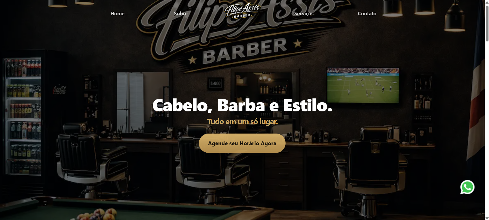

# 💈 Filipe Assis Barber — Landing Page Premium

🔗 **Acesse o projeto online:**  
👉 https://assisfilipee.github.io/Site-Barbearia/

---

## 📖 Sobre o Projeto

Landing page profissional desenvolvida para uma barbearia fictícia (**Filipe Assis Barber**) com foco total em:

- 🎯 Conversão de visitantes em clientes  
- 🎨 Design premium e moderno  
- ⚡ Performance e carregamento rápido  
- 📱 Experiência responsiva em todos os dispositivos  

O projeto foi pensado para simular um site real de negócio local, ideal para portfólio e demonstração de habilidades em **UI, UX e Front-end**.

---

## ✨ Principais Funcionalidades

- Hero fullscreen com imagem de impacto  
- Navegação fixa com efeito glass no scroll  
- Seções estruturadas para conversão  
- Cards de serviços e planos  
- Seção de cursos com destaque visual  
- Integração com WhatsApp para agendamento  
- Mapa incorporado na seção de contato  
- Layout totalmente responsivo  
- Footer minimalista  

---

## 🛠️ Tecnologias Utilizadas

- **HTML5**
- **CSS3 (Grid + Flexbox)**
- JavaScript (interações básicas)
- Boas práticas de SEO on-page
- Estrutura sem frameworks (pure code)

---

## 🎯 Objetivo do Projeto

Este projeto foi criado com o objetivo de:

✔ Demonstrar habilidades em desenvolvimento front-end  
✔ Criar um layout realista para negócios locais  
✔ Praticar design orientado à conversão  
✔ Servir como peça de portfólio profissional  

---

## 📸 Preview

A imagem no topo do README leva diretamente para a versão online do projeto.

---

## 👨‍💻 Autor

Desenvolvido por **Filipe Assis**

🌐 https://filipeassis.dev  

---

## 📄 Licença

Este projeto foi criado apenas para fins de portfólio e demonstração.
